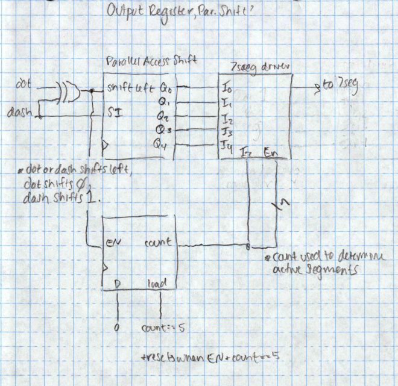

# lab-10---morse-decoder-berberian-minas-snyder-chandler
lab-10---morse-decoder-berberian-minas-snyder-chandler created by GitHub Classroom

https://youtu.be/Z_0cHkeyXms

Morse State Diagram: 

Register Block Diagram: 

 
